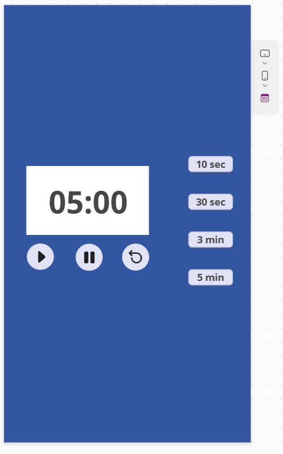

# ⏱️ Timer Application in PowerApps

This is a **custom timer app** built using **Microsoft PowerApps**. The app includes essential timer functionalities such as **pause**, **resume**, and **restart**, and offers preset durations including **10 seconds, 30 seconds, 10 minutes, and 30 minutes**. It is designed for simple time-tracking tasks and can be used in productivity tools, workouts, breaks, and more.

---

## ✨ Features

- ⏲️ **Preset Durations**:
  - 10 seconds
  - 30 seconds
  - 10 minutes
  - 30 minutes
- ⏸️ **Pause Timer**
- ▶️ **Resume Timer**
- 🔁 **Restart Timer**
- 🧠 Logic handled using PowerApps timers and variables

---

## 🖼️ Screenshot

*A simple and effective timer with custom controls built in PowerApps.*

---

